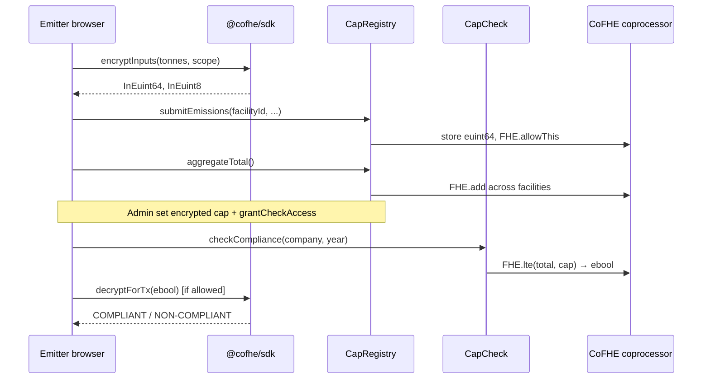

# CovertMRV

> **Encrypted carbon compliance.** Prove you meet your emissions cap without revealing what your emissions are.

[](https://sepolia.arbiscan.io/)
[](https://soliditylang.org/)
[](https://www.npmjs.com/package/@cofhe/sdk)
[](#deployed-contracts-arbitrum-sepolia)
[](#testing)
[](https://covert-mrv.vercel.app)

---

## Table of contents

1. [What problem we solve](#what-problem-we-solve)
2. [What CovertMRV is](#what-covertmrv-is)
3. [How FHE works in this project (not hand-wavy)](#how-fhe-works-in-this-project-not-hand-wavy)
4. [System architecture](#system-architecture)
5. [End-to-end flows](#end-to-end-flows)
6. [Disclosure model & roles](#disclosure-model--roles)
7. [Deployed contracts](#deployed-contracts-arbitrum-sepolia)
8. [Features](#features)
9. [Tech stack](#tech-stack)
10. [Quick start](#quick-start)
11. [Testing](#testing)
12. [Production / Vercel](#vercel--production-environment)
13. [License](#license)

---

## What problem we solve

Traditional MRV (Measurement, Reporting, and Verification) for carbon compliance forces a painful trade-off:

| Today (plaintext MRV) | Pain |
|----------------------|------|
| Facility emissions published on registries | Competitors infer production, fuel mix, and strategy |
| Caps and totals visible on-chain or in APIs | Market signals leak before public disclosure |
| Scope 3 supplier data shared for audits | Suppliers fear factor leakage to buyers |
| Compliance = boolean + tonnes in same report | Regulators get more than they need for pass/fail |

**CovertMRV** keeps tonnes, caps, scopes, supplier factors, and credit balances as **FHE ciphertexts** on Arbitrum Sepolia. The chain performs real homomorphic operations (`FHE.add`, `FHE.lte`, `FHE.select`) via the **Fhenix CoFHE** coprocessor. Only addresses you explicitly authorize can decrypt—and only the handles you grant.

What regulators and the public still get when appropriate:

- An **encrypted** compliance result (`ebool`) until someone with permission decrypts it
- A **public settlement** boolean + ERC-721 certificate metadata after `settleCompliance` (admin)
- **No** facility-level plaintext on-chain events (reporting year and scope removed from events by design)

---

## What CovertMRV is

CovertMRV is an FHE-powered Measurement, Reporting, and Verification protocol for:

1. **Corporate cap compliance** — encrypted facility submissions → homomorphic aggregate → encrypted compare to encrypted cap
2. **ISO 14064 scopes** — scope stored as `euint8` (0=Scope 1, 1=Scope 2, 2=Scope 3), not a public enum
3. **Time-bounded audit disclosure** — `grantAuditAccessToTotal` gives an auditor decrypt rights on the aggregate for N seconds
4. **Supply chain (ScopeX)** — suppliers attest encrypted intensity factors; products roll up footprints with `FHE.allowTransient`
5. **Conditional carbon credits** — `CreditIssuer` mints `cCO2` via `FHE.select` only when compliance `ebool` is true (both branches execute homomorphically)

**Live app:** https://covert-mrv.vercel.app  
**In-app docs:** `/docs` (architecture, SDK snippets, disclosure ladder)

---

## How FHE works in this project (not hand-wavy)

This stack uses **[Fhenix CoFHE](https://cofhe-docs.fhenix.zone/)** on **Arbitrum Sepolia (421614)**.

### Client side (`@cofhe/sdk` 0.5.2 + `tfhe` 1.5.3 WASM)

| Step | What happens | Where in repo |
|------|----------------|---------------|
| Connect | `createCofheClient` + `connect(publicClient, walletClient)` for `arbSepolia` | `frontend/src/lib/fhe.ts` |
| Permit | `getOrCreateSelfPermit()` — no args in 0.5.2 | `fhe.ts` |
| Encrypt | `encryptInputs([Encryptable.uint64(tonnes), Encryptable.uint8(scope)])` → `InEuint64`, `InEuint8` | `useCovertMrv`, `api/submit.ts` |
| Submit tx | Wallet sends calldata with **ciphertext handles**, not plaintext | `CapRegistry.submitEmissions` |
| View decrypt | `decryptForView(handle, FheTypes.Uint64)` + session cache + 15s 404 retry | `fhe.ts` |
| Tx decrypt | `decryptForTx(eboolHandle)` for compliance boolean | dashboard Check tab |

The browser loads **`tfhe_bg.wasm`** (bundled under `frontend` assets). Vite dev serves WASM via custom middleware so the worker does not receive HTML by mistake.

### On-chain (`@fhenixprotocol/cofhe-contracts`)

| Operation | Used for |
|-----------|----------|
| `FHE.asEuint64(InEuint64)` / `FHE.asEuint8(InEuint8)` | Ingest client ciphertexts in `submitEmissions` |
| `FHE.add(a, b)` | Facility rollup + `aggregateTotal` + product footprint sums |
| `FHE.lte(a, b)` | `CapCheck.checkCompliance` — total ≤ cap without revealing either operand |
| `FHE.select(condition, ifTrue, ifFalse)` | Credit mint amount, footprint band classification |
| `FHE.allowThis(handle)` | Contract retains compute permission on stored handles |
| `FHE.allow(handle, addr)` | Persistent decrypt grant (emitter self, auditor, regulator) |
| `FHE.allowTransient(handle, addr)` | Same-transaction cross-contract read (SupplierAttest → ProductFootprint) |

**Important:** Homomorphic comparison produces an **`ebool`**. The cap and total stay encrypted; only parties with `FHE.allow` on that `ebool` (or after public settlement) learn the outcome.

### What is NOT decrypted on-chain by default

- Regulatory cap (`regulatoryCaps[company]`) — compared only inside `FHE.lte`
- Per-facility emissions and scope — unless emitter or time-bounded auditor decrypts
- Supplier factors — unless `grantFactorDecrypt` or transient read in same tx

---

## System architecture

### High-level component map

```
┌─────────────────────────────────────────────────────────────────────────────┐
│  Users: Emitter wallet · Auditor · Regulator/Admin · Enterprise API         │
└─────────────────────────────────────────────────────────────────────────────┘
         │                              │                         │
         ▼                              ▼                         ▼
┌─────────────────┐          ┌──────────────────┐    ┌─────────────────────┐
│ React dashboard │          │ Vercel API       │    │ Hardhat / CLI tasks   │
│ wagmi v2        │          │ POST /api/submit │    │ deploy:full, set-cap  │
│ @cofhe/sdk 0.5.2│          │ HMAC + server key│    │ verify:deployment     │
└────────┬────────┘          └────────┬─────────┘    └─────────────────────┘
         │ encrypt / decrypt          │ encrypt batch
         └──────────────┬─────────────┘
                        ▼
         ┌──────────────────────────────────────────────┐
         │  Arbitrum Sepolia 421614                        │
         │  CoFHE coprocessor (Fhenix) + 8 Solidity contracts │
         └──────────────────────────────────────────────┘
```

### Contract dependency graph

```
                    DisclosureACL (roles, audit grants)
                              │
         ┌────────────────────┼────────────────────┐
         ▼                    ▼                    ▼
   CapRegistry            CapCheck          ComplianceCertificate
   · submitEmissions      · checkCompliance   · settle → NFT
   · aggregateTotal       · reads ebool       · public metadata
   · setCap (admin)
         │
         │  (compliance ebool)
         ▼
   CreditIssuer ──mint──▶ cCO2 (FHERC20)
         │
   CreditRetire ──burn──▶ encrypted retirement receipt

   SupplierAttest ──allowTransient──▶ ProductFootprint
        · submitFactor                  · computeFootprint
        · grantFactorDecrypt            · classifyBand (FHE.select)
                                        · checkThreshold (FHE.lte)
```

### Data flow: emitter compliance (sequence)



### Privacy-oriented storage (CapRegistry)

Public mappings that leaked metadata were made **private**; the UI scans `getFacilityCount` + `isFacilitySubmitted` instead of a public facility ID list:

- `companyFacilities` — private array
- `hasSubmitted` — private flag
- Events omit `reportingYear` and scope (sensitive metadata)

---

## End-to-end flows

### 1. First-time emitter (dashboard Overview)

1. Connect wallet on https://covert-mrv.vercel.app/dashboard  
2. **Register as Emitter** — prominent card on Overview calls `CapRegistry.registerAsEmitter()` (self-service, no admin)  
3. Regulator/admin runs CLI `covertmrv:set-cap` for encrypted cap + `grantCheckAccess` on CapCheck  
4. **Submit Emissions** — encrypt per facility, `submitEmissions`  
5. **Aggregate** — `aggregateTotal()` (homomorphic sum)  
6. **Check Compliance** — `CapCheck.checkCompliance` → decrypt `ebool` in wallet  
7. Optional: **Audit grant** — `grantAuditAccessToTotal(auditor, durationSec)`  
8. Admin: **settleCompliance** → public boolean + ComplianceCertificate NFT  

### 2. Supply chain tab

1. Supplier registers on `SupplierAttest`, `submitFactor(sku, encrypted factor)`  
2. Product owner `computeFootprint` — reads factors via `FHE.allowTransient`  
3. `classifyBand` / `checkThreshold` — encrypted band + threshold compare  

### 3. Enterprise API

`POST /api/submit` with HMAC body auth — server wallet encrypts and batches `submitEmissions`. The server key must already be **EMITTER** on CapRegistry.

---

## Disclosure model & roles

### Roles (`DisclosureACL`)

| Role | Value | Capabilities |
|------|-------|----------------|
| NONE | 0 | Connect only; must `registerAsEmitter` |
| EMITTER | 1 | Submit, aggregate, request checks, grant audit to auditors |
| AUDITOR | 2 | Decrypt handles explicitly allowed (e.g. time-bounded total) |
| REGULATOR | 3 | Set caps, settlement, protocol policy |
| ADMIN | 4 | Owner; `grantRole`, full admin panel |

### Disclosure ladder (what each level can learn)

```
L0  Raw facility ciphertext     →  Emitter (FHE.allow to self via allowSender patterns)
L1  Company aggregate euint64   →  Emitter + auditor (TTL grant on total)
L2  Product band / footprint    →  Buyer paths via select + scoped allows
L3  Compliance ebool            →  Emitter decrypt; regulator on settlement
L4  Public settlement           →  Anyone (boolean + certificate metadata only)
```

Auditors never receive blanket decrypt rights—they get **specific handles** for **specific durations**.

---

## Deployed contracts (Arbitrum Sepolia)

Chain ID: `421614` · Deployer: [`0x2301CD93feC8249219b4b661b4bc81889b494De6`](https://sepolia.arbiscan.io/address/0x2301CD93feC8249219b4b661b4bc81889b494De6)

### Core compliance

| Contract | Address |
|----------|---------|
| CapRegistry | [`0x10e76b22Cc21B606c6d6aD9B1C4b0192e8168147`](https://sepolia.arbiscan.io/address/0x10e76b22Cc21B606c6d6aD9B1C4b0192e8168147) |
| CapCheck | [`0xAB5B0f9249AaB16dCe45bc45e24Ece6d2B14d189`](https://sepolia.arbiscan.io/address/0xAB5B0f9249AaB16dCe45bc45e24Ece6d2B14d189) |
| ComplianceCertificate | [`0xfC00455c683AFCC57FF47cbF38C3480222e7f437`](https://sepolia.arbiscan.io/address/0xfC00455c683AFCC57FF47cbF38C3480222e7f437) |

### Supply chain (ScopeX)

| Contract | Address |
|----------|---------|
| SupplierAttest | [`0x7B514F53ACcC6757e6BeB361A75F9f0A31552612`](https://sepolia.arbiscan.io/address/0x7B514F53ACcC6757e6BeB361A75F9f0A31552612) |
| ProductFootprint | [`0x8042463634B04bd9B39A2854ba614B9A05452c67`](https://sepolia.arbiscan.io/address/0x8042463634B04bd9B39A2854ba614B9A05452c67) |

### Carbon credits

| Contract | Address |
|----------|---------|
| cCO2 (FHERC20) | [`0xa9bA06359DDf073a226652F10f13863Af824cAd1`](https://sepolia.arbiscan.io/address/0xa9bA06359DDf073a226652F10f13863Af824cAd1) |
| CreditIssuer | [`0x83E5d71D7661D024C1E06E0c3C71b1e84Ce86664`](https://sepolia.arbiscan.io/address/0x83E5d71D7661D024C1E06E0c3C71b1e84Ce86664) |
| CreditRetire | [`0x5f280cFc9055f2f22C4E3f9115Cd86fAa0544320`](https://sepolia.arbiscan.io/address/0x5f280cFc9055f2f22C4E3f9115Cd86fAa0544320) |

---

## Features

| Area | Capability |
|------|------------|
| Compliance | Register emitter, submit/batch emissions, aggregate, check, settle, NFT certificate |
| ISO 14064 | Encrypted scope (0=Scope1, 1=Scope2, 2=Scope3) per facility |
| Audit | Time-bounded `grantAuditAccessToTotal` with on-chain expiry |
| Supply chain | Submit supplier factors, compute footprint, classify band, threshold check |
| Credits | Conditional mint via `FHE.select`, encrypted balance, retirement receipts |
| API | `POST /api/submit` — HMAC auth, server-side FHE batch submit |
| UI | Overview registration card, live decrypt console, contract panel with Arbiscan links |

---

## Tech stack

| Layer | Technology |
|-------|------------|
| Smart Contracts | Solidity 0.8.28, Fhenix FHE, viaIR, cancun |
| FHE | @cofhe/sdk 0.5.2, tfhe 1.5.3 WASM |
| Frontend | React 19, TanStack Router, Tailwind v4, wagmi v2 |
| API | Vercel Node.js function, HMAC-SHA256 |
| Network | Arbitrum Sepolia (421614) |
| Testing | Hardhat + @cofhe/hardhat-plugin — **72 tests** |

---

## Quick start

```bash
git clone https://github.com/0xelan/CovertMRV-
cd CovertMRV-
npm install
cd frontend && npm install

# Run tests
npx hardhat test

# Deploy full stack (8 contracts)
npx hardhat deploy:full --network arb-sepolia

# Verify wiring on-chain
npx hardhat verify:deployment --network arb-sepolia

# Dev server
cd frontend && npm run dev
```

### Frontend environment

Copy [`frontend/.env.example`](frontend/.env.example) to `frontend/.env.local` and set all `VITE_*` contract addresses (defaults also ship in `frontend/src/config/contracts.ts` from the deploy task).

If FHE WASM fails in dev after config changes, delete `frontend/node_modules/.vite` and restart.

### Enterprise API

```bash
curl https://covert-mrv.vercel.app/api/submit \
  -H "Authorization: Bearer <HMAC-SHA256(API_SECRET, body)>" \
  -H "Content-Type: application/json" \
  -d '{
    "facilityIds": [1, 2],
    "emissionsTonnes": [12500, 8300],
    "reportingYear": 2025,
    "scopes": [0, 0]
  }'
```

The `SUBMIT_PRIVATE_KEY` wallet must be registered as **EMITTER** on CapRegistry.

---

## Testing

```bash
npx hardhat test
# 72 passing — CapRegistry, CapCheck, CapRegistryPrivacy, DisclosureACL,
# SupplierAttest, ProductFootprint, cCO2, CreditIssuer, CreditRetire
```

---

## Vercel / production environment

Set these in the Vercel project dashboard (Production + Preview):

| Variable | Value |
|----------|-------|
| `VITE_CAP_REGISTRY_ADDRESS` | `0x10e76b22Cc21B606c6d6aD9B1C4b0192e8168147` (or omit — baked in `contracts.ts`) |
| `VITE_CAP_CHECK_ADDRESS` | `0xAB5B0f9249AaB16dCe45bc45e24Ece6d2B14d189` |
| `VITE_COMPLIANCE_CERTIFICATE_ADDRESS` | `0xfC00455c683AFCC57FF47cbF38C3480222e7f437` |
| `VITE_SUPPLIER_ATTEST_ADDRESS` | `0x7B514F53ACcC6757e6BeB361A75F9f0A31552612` |
| `VITE_PRODUCT_FOOTPRINT_ADDRESS` | `0x8042463634B04bd9B39A2854ba614B9A05452c67` |
| `VITE_CCO2_ADDRESS` | `0xa9bA06359DDf073a226652F10f13863Af824cAd1` |
| `VITE_CREDIT_ISSUER_ADDRESS` | `0x83E5d71D7661D024C1E06E0c3C71b1e84Ce86664` |
| `VITE_CREDIT_RETIRE_ADDRESS` | `0x5f280cFc9055f2f22C4E3f9115Cd86fAa0544320` |
| `CAP_REGISTRY_ADDRESS` | `0x10e76b22Cc21B606c6d6aD9B1C4b0192e8168147` |
| `ARBITRUM_SEPOLIA_RPC_URL` | `https://sepolia-rollup.arbitrum.io/rpc` |
| `API_SECRET` | *(your existing secret — do not rotate unless needed)* |
| `SUBMIT_PRIVATE_KEY` | *(your server wallet private key — must be EMITTER)* |

After updating env vars, trigger a **Redeploy** in Vercel so the frontend build picks up the new `VITE_*` addresses.

---

## License

MIT · Built on [Fhenix CoFHE](https://cofhe-docs.fhenix.zone/)
